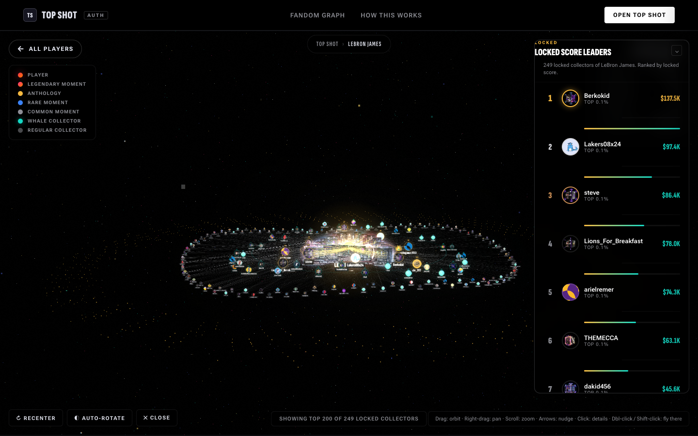

# Top Shot · Fandom Graph

A 3D visualization of every minted NBA Top Shot Moment for a given player, plus every Flow wallet that owns one. Live at **[fandom-v3.vercel.app](https://fandom-v3.vercel.app)**.

Pick an athlete, fly through their universe of editions and collectors, click any whale to see the exact slice of their collection, and watch the percentage of their completion light up.



## What it is

- A static HTML/JS site with one `<script>` of vanilla three.js + [3d-force-graph](https://github.com/vasturiano/3d-force-graph). No framework, no build step.
- Per-player JSON files (`/data/<playerId>.json`) that contain every edition + every minted serial + every owner.
- A canonical fetcher (`scripts/fetch-6-accurate.js`) that builds those JSON files from NBA Top Shot's public GraphQL.

## What's real

- Every node in the graph is a real Moment. Every edge is a real Flow wallet that owns one.
- Numbers come from the public NBA Top Shot API at `public-api.nbatopshot.com/graphql`. No login required, no proprietary data, no mock.
- The headline number ("LeBron James · 288,890 Moments") is the sum of every edition's `circulationCount` — the canonical supply.
- See [methodology.html](./methodology.html) for the data-flow + filtering details.

## Quick start

Serve the directory with any static server:

```bash
# Python
python3 -m http.server 8000
# or Node
npx serve .
```

Open `http://localhost:8000/fandom.html`.

## Regenerating data

The `data/*.json` files are regenerable from the public Top Shot API. To refresh:

```bash
# Refetch all 6 default players (LeBron, Wembanyama, Curry, Jokic, Luka, Durant)
node scripts/fetch-6-accurate.js --concurrency=2

# Or pick specific players by NBA ID:
node scripts/fetch-6-accurate.js --only=2544,201939

# Tune sampling: full circulation per edition vs. capped sample
MAX_SERIALS_PER_EDITION=2000 node scripts/fetch-6-accurate.js
```

The fetcher uses a 3-stage fanout (plays → editions → minted moments per edition) to bypass the `searchMintedMoments(byPlayers:[id])` 15K cap. See `scripts/fetch-6-accurate.js` header for details.

To extend the roster, edit `scripts/roster.json` and add player entries with NBA `playerId`, name, team, and team colors.

## Architecture

```
fandom.html       Entry point. Picker + canvas + drawer + leaderboard rail.
methodology.html  Public-facing "how it works" page.
fandom.js         All viz logic — three.js scene, OrbitControls, spotlight, drawers.
data-layer.js     Lightweight per-player loader with sessionStorage cache.
router.js         URL-driven state (?u=Cuteknick, ?spotlight=<addr>, ?player=...).
styles.css        All site CSS.
data/             Per-player JSON files + index.json (regenerable).
scripts/          Data ingestion tooling.
```

Everything is client-side. Vercel serves it statically with cache headers in `vercel.json`.

## What's filtered

- Top Shot's pack-distribution wallet (`b6f2481eba4df97b`) is excluded — it holds tens of thousands of Moments waiting for sale, not as a fan.
- Heuristic: any unnamed wallet holding more than 1,500 Moments of a single player is treated as a system account (exchange, treasury) and filtered out.

## License

MIT — see [LICENSE](./LICENSE). Use it, fork it, change the players, swap the data source, do whatever.

## Acknowledgments

- [NBA Top Shot](https://nbatopshot.com) for shipping a public GraphQL API and not gating it.
- [3d-force-graph](https://github.com/vasturiano/3d-force-graph) by Vasco Asturiano.
- [three.js](https://threejs.org), [GSAP](https://greensock.com/gsap/) for tweening.
